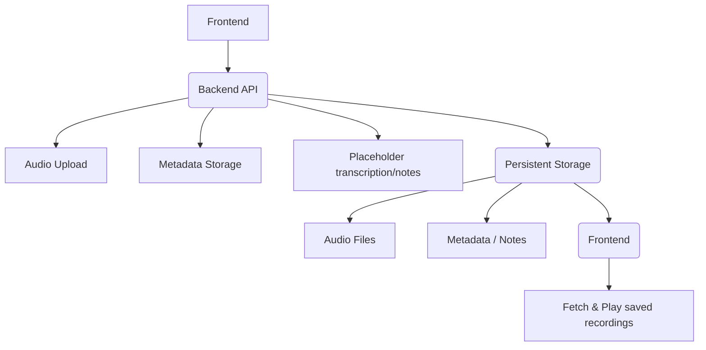
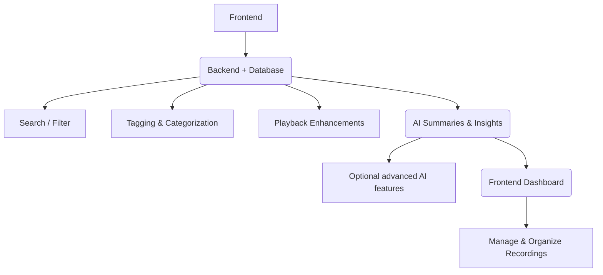

# VoiceNote-AI MVP Development Roadmap

This document outlines the phased roadmap and development plan for the VoiceNote-AI application, including frontend, backend, AI integration, and advanced features. It is intended for feeding into Cursor IDE or other AI-assisted development environments to generate or guide code implementation.

---

## Phase 1 — UI & Basic Frontend

**Objective:** Make the app usable and intuitive with placeholder components for backend or AI-dependent features.

### Tasks:

*   Enhance Mocha UI for responsiveness and clarity.
*   Add audio recording controls (Start / Pause / Stop).
*   Show waveform or visual cue for recording.
*   Display recording metadata (duration, quality).
*   Use placeholders for AI summaries and storage.

### Deliverables:

*   Fully functional frontend deployed (Vercel/Netlify).
*   User can record audio and see visual feedback.

### Data Flow:

```mermaid
graph TD
    A[User] --> B(Frontend (React / Typescript))
    B --> C[Audio Recording Controls]
    B --> D[Waveform Display]
    B --> E[Metadata Display]
    B --> F[Placeholders for AI Summaries / Storage]
```

---

## Phase 2 — AI Summaries Integration

**Objective:** Add basic AI capabilities for MVP-level intelligence.

### Tasks:

*   Integrate OpenAI API (Whisper for transcription).
*   Generate short, medium, and detailed summaries.
*   Display AI-generated summaries in the frontend.

### Deliverables:

*   Users see transcription & AI summaries.
*   Frontend displays real-time or post-recording summaries.

### Data Flow:

```mermaid
graph TD
    A[Audio Recording (Frontend)] --> B(API Call --> AI Service (OpenAI Whisper / ChatGPT))
    B --> C[AI Summaries]
    C --> D[Short]
    C --> E[Medium]
    C --> F[Detailed]
    C --> G(Frontend Display)
```

---

## Phase 3 — Core Backend & Storage

**Objective:** Enable storage and basic backend workflows.

### Tasks:

*   Backend API (Python/FastAPI or Node.js):
    *   Audio Upload Endpoint
    *   Metadata Storage (Supabase/Postgres)
    *   Placeholder transcription/notes
*   Connect frontend to backend API.
*   Store audio files and metadata persistently.

### Deliverables:

*   Backend deployed on Render/Railway.
*   Frontend connected to backend.
*   Audio files and metadata are retrievable.

### Data Flow:



---

## Phase 4 — Advanced Features & Enhancements

**Objective:** Add extra functionality and polish the app.

### Tasks:

*   Search and filter voice notes.
*   Tagging and categorization.
*   Playback enhancements (speed, trimming).
*   Dashboard for managing recordings.
*   Optional advanced AI features (action items, keywords).

### Deliverables:

*   Fully polished MVP with advanced features.
*   Users can manage, search, and organize recordings.

### Data Flow:



---

### MVP Principles

1.  **Frontend-first:** UI fully usable with placeholders for unimplemented features.
2.  **AI Integration:** Phase 2 introduces AI summaries before full backend.
3.  **Backend:** Phase 3 ensures storage and persistence.
4.  **Advanced Features:** Phase 4 adds search, tagging, dashboard, and optional AI enhancements.

---

### Deployment Recommendations

*   **Frontend:** Vercel or Netlify (free tier for MVP).
*   **Backend:** Render, Railway, or Supabase serverless functions.
*   **Database:** Supabase Postgres (free tier sufficient for MVP).
